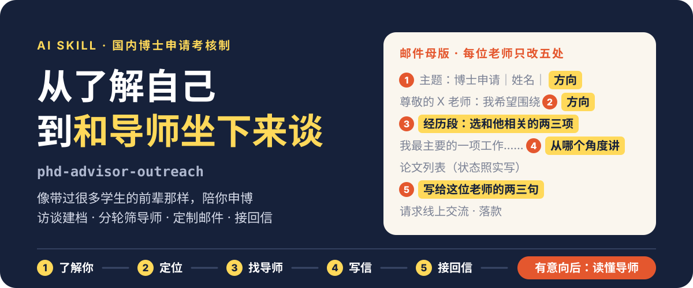
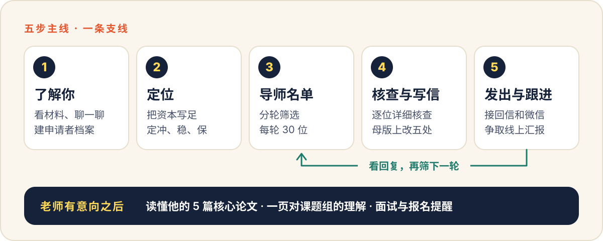

<p align="center">
  
</p>

# phd-advisor-outreach

一个给 AI 用的申博 skill。装上之后，Claude、Codex 这类工具会像一位带过很多学生的前辈那样，陪你从“还没想清楚”走到“和导师约上交流”：先问清你有什么、想要什么，再筛导师、写定制邮件、接回信；老师有了意向，再帮你读懂他的方向。

适用于**国内博士申请考核制**，理工与生医方向。

<p align="center">
  
</p>

## 它解决什么问题

第一次申博，难的往往不是写邮件，而是没人带你把整件事过一遍：

- **没过六级，不知道还能不能申。** 各校对英语的要求不一样，哪些卡、哪些不卡，没人告诉你。
- **不知道自己值多少。** 用过的技能不敢写，自己主导的工作说成“参与”。
- **不知道往哪申。** “想去好一点的学校”不是方向，也筛不出导师。
- **邮件每封从零写。** 要么耗死自己，要么只换个名字，导师一眼看穿。
- **回信和微信不会接。** “欢迎报考”到底有没有戏，该不该再争取；好不容易加上微信，发了一句“老师好”就不知道说什么。

## 它和套磁信模板有什么不同

它不是一份模板，而是一套做事的方法，核心是三条：

| 指导思想 | 意思 |
|---|---|
| 把你的资本写足，但不过线 | 有真实基础、面试前又补得上的技能和能力，就写上，并记进“补课清单”，面试前带你补。论文状态、署名、数据这些查得到的事实照实写，没做过的不写成做过 |
| 每个判断都说出来，由你定 | 它替你做的每个决定都会告诉你定了什么、为什么，并问你行不行。方向不让你自己报一个词，而是从你的材料里提炼出来，再和你一起定 |
| 每一次联系都在争取一次对话 | 申博不是靠邮件录取的。首发、回复、跟进，目标都是争取一次线上交流，或者加上导师的微信；加上微信也不是终点，接着约线上汇报的时间。老师态度积极就明确提，婉拒了就得体收尾 |

## 它怎么工作

<p align="center">
  
</p>

| 步骤 | 做什么 | 你会得到 |
|---|---|---|
| 1 了解你 | 先请你把现有的资料放进文件夹（做好的简历、论文和稿件、成绩单等，有什么放什么），读完只问材料里没有的；用带代价的选择题问清你的想法，提炼研究方向。会先告诉你还要聊哪几块，三轮左右聊完，着急可以先看名单 | 申请者档案，方向总结 |
| 2 定位 | 评估你的竞争力，定冲、稳、保 | 一页定位结论 |
| 3 导师名单 | 分轮筛，每轮 30 位。怎么筛你来选：综合最优、按地区、按院校层级、按心仪的学校、按某个子方向。先出 10 位请你看方向对不对，再补齐。逐校查英语要求，标明卡不卡六级，卡住的给替代方案和还能不能冲 | 导师名单表，含职称、人才称号、方向、契合点、英语门槛 |
| 4 核查与写信 | 先做一份你的邮件母版，已经有在用的邮件就先体检；简历、工作介绍、研究计划缺哪份帮你起草；每位导师先详细核查（近两年在做什么、今年招不招、学生能不能拿一作），再在母版上改五处 | 邮件母版，附件的文字稿，每位导师的核查记录和邮件 |
| 5 发出与跟进 | 邮件写好交给你，它就按你当天发出去来记，一周后提醒跟进。回信贴给它，它告诉你含义并写好回复，有名额、约面试、婉拒、推荐别人、一直不回等 11 种情况都有对应的回法。加上微信之后，开场白、发材料、约时间的话它帮你拟。你每次回来，它按每位导师走到哪一步点名问你。回复少的时候做一次复盘：邮件到了没有、邮件本身、选的人、定位，依次查 | 联系账本，每封回信的回复，微信上的开场白和约时间的话 |
| 支线 意向阶段 | 老师有意向后，挑 5 篇读懂他方向的论文，陪你读；面试前把写进邮件但还讲不透的技能逐项带你补上；查简章，把面试和报名的日期做成日历文件，并一步步教你导进手机 | 意向导师表，核心论文清单，一页对课题组的理解，日历提醒 |

**每位导师走到哪一步，它心里有数。** 候选、已发送、邮件有回复、已加微信、已约面试、已面试、明确意向，每一级的目标都是往上走一级。回信是正向的，这位导师就进意向导师表，单独盯着。

**没过六级怎么办。** 它不会替你下“申不了”的结论。筛导师时逐校查当年的招生简章，在名单表的“英语门槛”一列标明：不卡、卡六级、卡分数、临界，或者没查到。卡住的学校，告诉你简章里有没有替代条件（比如英文一作论文、其他英语考试）、重考来不来得及，以及还值不值得冲。你也可以让它按“不卡六级优先”来筛。学校的要求每年会变，它只按当年简章说话，查不到就说没查到。

第一次使用时，它会在你的桌面建一个 `申博资料` 文件夹，全程的东西都归在这里：

```text
申博资料/
├── 待办与日程.md     你两次对话之间要做的事、要记住的日子
├── 申博提醒.ics      面试、报名、跟进的日期，导入手机日历后到点提醒
├── 01_我的材料/      你放简历、论文、成绩单
├── 02_档案/          申请者档案、邮件母版、联系账本
├── 03_申请材料/      发给导师的简历、工作介绍等定稿
├── 04_导师联系/      导师名单表，和联系过的每位导师
├── 05_意向导师/      意向导师表，每位意向导师的文献、PPT、面试准备
├── 06_院校报名/      各学校的简章和报名材料
└── 07_临时文件/
```

## 怎么用

1. 把仓库拿下来：

   ```bash
   git clone https://github.com/lywkx99/phd-advisor-outreach.git
   ```

2. 把其中的 `skills/phd-advisor-outreach` 整个文件夹复制到你所用 AI 工具的 skill 目录。

   - Claude Code：`~/.claude/skills/`（Windows 是 `C:\Users\你的用户名\.claude\skills\`）
   - Codex 等其他工具：放进它的 skill 目录，位置见该工具的文档
   - 不支持 skill 的 AI：把整个文件夹给它，让它先读 `SKILL.md` 和里面指向的文件

3. 开一个新对话，直接说你的情况，比如：

   ```text
   我想读博，不知道怎么开始。
   ```

   已经有想联系的导师，也可以直接把他的主页和你的简历、论文发过去。

不需要额外安装任何东西。电脑上有 Python 时，它会用 `scripts/` 里的几个小脚本帮忙建文件夹、查重、生成日历提醒；没有也能用。

## 仓库里有什么

```text
skills/phd-advisor-outreach/
├── SKILL.md              入口：身份、指导思想、流程、任务入口
├── references/           十四份方法文件
│   ├── expert-stance.md      怎么交流、什么时候介入
│   ├── workflow.md           五步怎么推进，怎么让你知道下一步
│   ├── interview-guide.md    引导式访谈和方向提炼
│   ├── capital-assessment.md 怎么把资本写足、怎么定位
│   ├── scouting.md           分轮筛导师和名单表
│   ├── email-model.md        邮件母版和五处定制
│   ├── reply-playbook.md     11 种回信的回法，加上微信之后怎么聊
│   ├── intent-stage.md       意向阶段：五篇论文、面试和报名
│   └── ……
├── assets/               档案、联系账本、名单表、意向导师表、邮件骨架、待办的空白模板
└── scripts/              建文件夹、查档案完整度、查重、日历提醒、自检（都只用 Python 标准库）
```

## 说在前面

- **这是 0.2 版。** 它由作者自己的申博经历整理而成，还没有经过多人真实使用的检验。用的过程中发现问题，欢迎提 issue。
- **它不保证录取。** 它只帮你把每一步做扎实。
- **邮件要你自己发。** 它只写稿，不替你发送。
- **它看不到你的邮箱和微信。** 导师回了信、加了微信、约了时间，需要你告诉它，把原文或截图贴给它。
- **它没法主动找你。** 面试和报名的日期，它会做成日历文件让你导入手机，由日历来提醒；你每次回来，它也会先把到期的事提出来。
- **经验不等于规定。** 里面关于流程、名额、档位的说法是通行经验，各校政策以当年招生简章为准。
- **范围有限。** 海外申请和人文社科的评判标准不同，目前不适用。
- **你的材料在你自己手里。** skill 本身只是一组说明文件，不收集、不上传任何东西；你的档案都存在你电脑上的 `申博资料` 文件夹里。材料会经过你所使用的 AI 工具，这一点请自己留意。

## 自检

改动过 skill 里的文件之后，可以跑一遍自检，确认文件、链接和各处定义仍然一致：

```bash
python skills/phd-advisor-outreach/scripts/validate_skill.py
```

## License

[MIT](./LICENSE)
